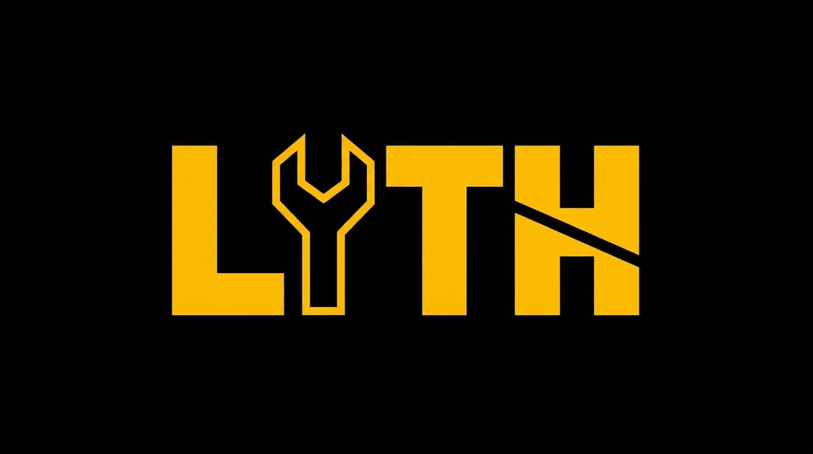

<p align="center">
  
</p>

# LYTH

> A kernel that cannot say what it costs does not compile.

Memory-first kernel dialect for bare-metal HPC & quantum computing.

**A `.lyth` file compiles to PTX and runs.** Movement is declared; arithmetic is subordinate to
it. The intensity written in the source is checked against the one the compiler derives from the
body — a mismatch does not compile. `lyth-probe` still works over CUDA you already have.

```
machine sm_120

kernel saxpy(n: u32, a: f32, x: [f32; n], y: [f32; n])
    intensity 0.1667

    stream x : dram -> reg
    stream y : dram -> reg, drain

    at reg:
        y = a * x + y
```

```
$ lyth run examples/saxpy.lyth --machine fixtures/machine/sm_120.json -n 1048576 --set a=2.5
kernel saxpy on machine sm_120
  derived  0.1667 flop/byte  (2 flop / 12 byte per element)
  payload  8 read + 4 written, at dram
  declared 0.1667 — matches
  ridge    42.9 flop/byte — memory-bound
  device   NVIDIA GeForce RTX 5060 Ti
  launch   grid 4096 x block 256 over 1048576 elements, 0 B shared
  verify   BIT-EXACT against the IR evaluated on the host, 1048576 elements
ok
```

Declare an intensity the body does not have and it is a compile error that names the machine's
ridge and what to write instead. Nobody types the number on the right-hand side of that
comparison — it is counted from the streams and the expression tree.

The compiler's own byte model, checked against `ncu` on the kernel it generated:
**12.0013 measured vs 12.0000 derived bytes per element at L2 — 1.0001x** (ADR-0010).

## A cost that depends on the schedule, not on the body

The same transpose, twice. The body is identical; two declared lines differ.

```
    space i, j : rows, cols                  space i, j : rows, cols
                                             tile 32, 32
    stream a : dram -> reg                   stream a : dram -> smem -> reg
    stream b : dram -> reg, drain            stream b : dram -> reg, drain

    at reg:                                  at reg:
        b[j, i] = a[i, j]                        b[j, i] = a[i, j]
```

The compiler derives a different bus cost for each, because the second moves the transposition
off the memory bus and into shared memory, where a derived one-element skew makes it free:

```
  untiled   sectors  4 read + 32 written at L1->L2  (coalescence 0.222)
  tiled     sectors  4 read +  4 written at L1->L2  (coalescence 1.000)
            shared   4 read +  4 written per element, 4224 B per block
```

Measured at 4096 x 4096 with `lts__t_bytes.sum`, against a pre-registered `8.00 ± 0.2`:

| kernel | measured B/element | derived | why they differ |
|---|---|---|---|
| `transpose` | 38.97 | 36 | read-for-ownership |
| `transpose-tiled` | **8.00** | **8** | nothing |
| `copy2d`, the coalesced control | 8.00 | 8 | nothing |

The untiled kernel exceeds its own model by 2.97 bytes per element and the tiled one does not,
which is the best thing in this table. A strided store touches 4 bytes of a 32-byte sector; the
sector is evicted before the other seven writes arrive and has to be fetched back. **The model
counts sectors, so it cannot see traffic caused by a sector being counted twice.** Under the
tile every sector is filled by one warp in one instruction, the mechanism has nothing to act on,
and derived equals measured because there is nothing else left to count.

And the skew, measured the same way with its counterfactual — the same kernel emitted without
the padding, checked bit-exact first so that it is the same computation and only the layout
differs:

| shared loads | conflicts |
|---|---|
| stride 33, derived | **0** |
| stride 32, unpadded | **1,017,813** |

32,768 warp-level loads at 31 extra accesses each is 1,015,808. The counterfactual lands 0.2%
from full 32-way serialisation, so the skew is not correlated with the absence of conflicts —
it removes exactly the serialisation the derivation says it removes.

And the time, because 4.87x less traffic implying "faster" is exactly the sort of unmeasured
implication this repository refuses elsewhere:

| kernel | median of 7 | spread | payload GB/s |
|---|---|---|---|
| `transpose` | 1.8816 ms | 33.0% | 71.33 |
| `transpose-tiled` | **0.4604 ms** | **1.3%** | 291.53 |
| `copy2d` | 0.3522 ms | 1.4% | 381.06 |

**4.09x faster** against 4.87x less traffic; the gap is the shared round trip and the barriers
the tile adds. The spread is the other half of the result — the untiled kernel's time swings by
a third between runs because it depends on what the cache evicted, and the tiled one does not.

This is the first claim in the project that a competent engineer would not get right by
inspection, and the first cost that is a function of a schedule the author declared rather than
of the body they wrote. The 33 in the shared layout is derived from the bank count, not typed.
ADR-0017.

**Both numbers in that table are checked, including the one that failed.** The untiled control
was pre-registered at 36.00 and measured 38.97, which is outside its tolerance — the
pre-registration took the model's number where ADR-0015 had already published a measurement of
the same kernel at the same size. The error is recorded in the ADR rather than adjusted.

## Status

| Phase | What | State |
|-------|------|-------|
| 0 | evidence CLI | **done** |
| 0.5 | Unibit oracle vs silicon | **FAIL — `@oracle` out** |
| 1 | machine-as-value + peak | **live** |
| 1b | intensity-as-type | **live** |
| 1c | kernel IR | **live** (integrate / propagate / gate_proj) |
| 1d | constant-time taint | **live** |
| 1e | layout × machine poly | **live** (gate_proj INT4 vs NF4) |
| 2 | `.lyth` parser + PTX back end + runner | **live** — ADR-0010 |
| 3 | layout × machine in the language | **live** — shapes, rank 2, ADR-0015 |
| 3b | callable from Rust, C and Python | **live** — ADR-0016 |
| 3c | the tile, and a schedule-dependent cost | **live** — ADR-0017, traffic confirmed |

## Commands

```bash
cargo test --workspace

# The language: check (no GPU), emit PTX, run and verify bit-exactly.
cargo run -p lyth -- check examples/saxpy.lyth --machine fixtures/machine/sm_120.json
cargo run -p lyth -- build examples/saxpy.lyth --machine fixtures/machine/sm_120.json   -o examples/saxpy.ptx --evidence examples/saxpy-evidence.json --elements 16777216
cargo run -p lyth -- run   examples/saxpy.lyth --machine fixtures/machine/sm_120.json   -n 1048576 --set a=2.5

# Refusals. Both exit 1.
cargo run -p lyth -- check examples/saxpy-lie.lyth --machine fixtures/machine/sm_120.json
cargo run -p lyth -- check examples/forgot-stream.lyth

# The accounting the compiler derived, against measured traffic. Nobody wrote it by hand.
cargo run -p lyth-probe -- intensity-check examples/saxpy-evidence.json   --machine fixtures/machine/sm_120.json   --ncu fixtures/ncu/saxpy-lyth-sm_120-2026-09-14.csv --ncu-dir read

cargo run -p lyth-probe -- suite fixtures/suite-fase1.json
cargo run -p lyth-probe -- suite fixtures/suite-fase1.json

cargo run -p lyth-probe -- kernel-check fixtures/kernel/gate_proj_int4.json \
  --machine fixtures/machine/sm_120.json

cargo run -p lyth-probe -- poly-check fixtures/poly/gate-proj-int4-nf4.json \
  --machine fixtures/machine/sm_120.json

cargo run -p lyth-probe -- ct-check fixtures/ct/kyber-ntt-ok.json
cargo run -p lyth-probe -- ct-check fixtures/ct/secret-gather-fail.json

# The byte accounting against measured DRAM/L2 traffic, not against itself (ADR-0009).
# CONFIRMED at l2 — 28.41 measured B/neuron vs 29.00 counted, 0.9796x.
cargo run -p lyth-probe -- intensity-check fixtures/intensity/k_integrate.json   --machine fixtures/machine/sm_120.json   --ncu fixtures/ncu/k_integrate-sm_120-2026-09-14.csv --elements 166700 --ncu-level l2

# The read half of the same accounting: CONFIRMED to 0.32%. The write half never
# leaves L2, so a single-launch DRAM measurement cannot see it (ADR-0009).
cargo run -p lyth-probe -- intensity-check fixtures/intensity/k_integrate.json   --ncu fixtures/ncu/k_integrate-sm_120-2026-09-14.csv --elements 166700 --ncu-dir read

# A kernel whose element count depends on its input: measure the count from the same
# report. INFLATED 3.15x -- a scattered 4-byte atomic moves a 32-byte sector.
cargo run -p lyth-probe -- intensity-check fixtures/intensity/k_propagate.json   --ncu fixtures/ncu/k_propagate-sm_120-2026-09-14.csv --ncu-dir read   --elements-from l1tex__t_sectors_pipe_lsu_mem_global_op_red.sum
```

## Docs

ADR-0001 … ADR-0010 under `docs/`.

`docs/DOGFOOD.md` is the running record for the ADR-0001 parser gate: one row per kernel
put through the tool, and for each one whether a Rust macro would have done the same job.

## Crates

| crate | what |
|---|---|
| `lyth-lang` | lexer, parser, semantic IR, **cost derived from the AST**, host interpreter |
| `lyth-ptx` | IR → PTX. No CUDA dependency, so emission is testable without a GPU |
| `lyth-cuda` | CUDA Driver API. All `unsafe` in the project lives here. `raw-dylib`, so **no toolkit is needed to build** |
| `lyth` | the compiler binary: `check`, `build`, `run` |
| `lyth-probe` | evidence, machine-as-value, intensity, measured traffic |

## License

Proprietary. All rights reserved. See [LICENSE](LICENSE). Visibility for review or
evaluation grants no right of use beyond reading.
